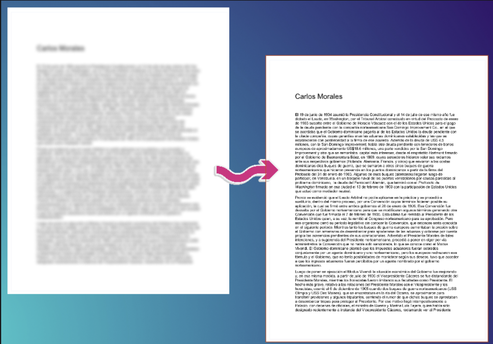
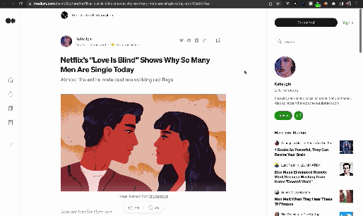

# Let Me Read

    

    
    

A Chrome extension that allows you to read those documents which texts are blurred or content is limited by local cookies.

For now only works on scribd, studocu and medium, but in the future is supposed to be more expanded for pages that blur or limite their content using client.

> IMPORTANT: This extension do not collect any user data or retrieve data from any server

> IMPORTANT: This extension is currently working but it cannot be publish on chrome extensions, but you can obtaine the most recent package <a download href="/common/letmeread.crx" name="letmeread-signed.crx">here</a>

* [How to install unofficially](#How-to-install-unofficially)
* [How it works unblurring](#How-it-works-unblurring)
* [How it works for limited content](#How-it-works-for-limited-content)

## How to install unofficially

If you are using based Chromium browsers go to `chrome://extensions`, enable developer mode and click on `Load unpacked` and select the src folder and that's all

## How it works unblurring
<figure>
    
    <figcaption>An example of how the extension works in those documents</figcaption>
</figure>

## How it works for limited content
<figure>
    
    <figcaption>An example of how the extension works on medium</figcaption>
</figure>
